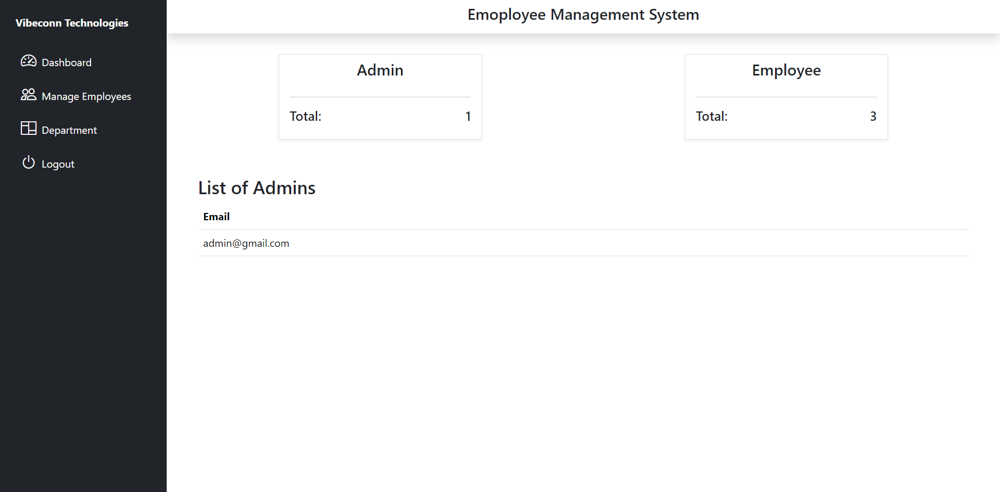
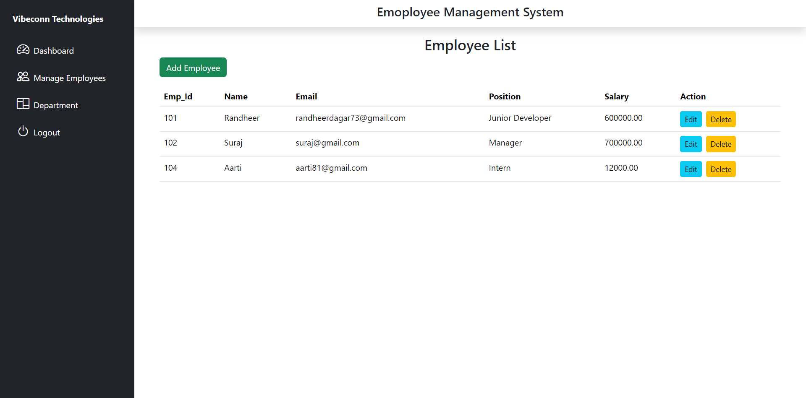
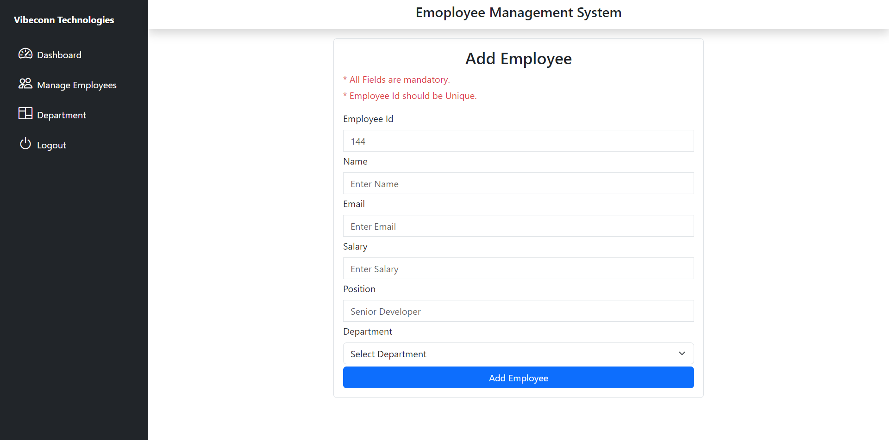
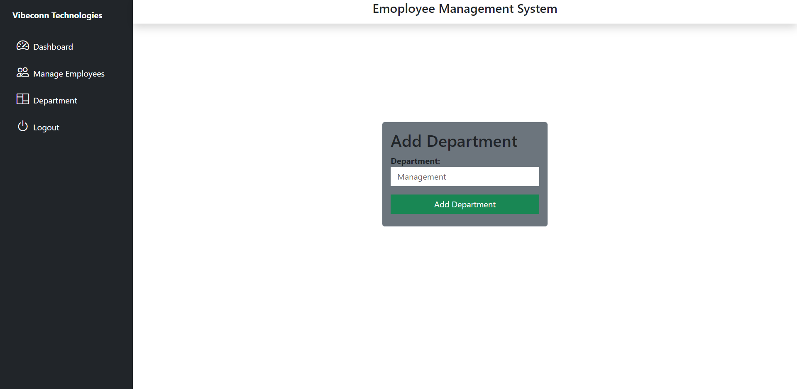

<h1 style="text-align:center">EMPLOYEE MANAGEMENT SYSTEM</h1>

The Employee Management System (EMS) is a web-based application designed to streamline the management of employee data. This system enables an administrator to perform full CRUD operations (Create, Read, Update, Delete) on the employee database, ensuring efficient employee record management.

<h3>Key Features:</h3>

Admin-Only Access:The application includes an authentication system that restricts access to only authorized administrators. This ensures the confidentiality and integrity of employee data.

Employee Database Management:  Admins can:
<ul>
<li>Add new employee records</li>
<li>View detailed employee information</li>
<li>Update existing employee data</li>
<li>Remove employees from the system</li>
</ul>

User-Friendly Interface:A clean and intuitive interface that simplifies the management process for administrators.

<h2>Technologies Used</h2>
<ul>
<li>React : Provides a dynamic and responsive user interface for the admin to manage employee records easily.</li>
<li>Node.js : Handles the backend logic and processes API requests between the frontend and the database.</li>
<li>MySQL : Stores and manages employee data, allowing efficient CRUD operations on the employee table.</li>
</ul>

<h2>User Interface Preview</h2>

<h2>Installation</h2>
<ol>
<li>Clone the Employee Management System repository to your local machine using the following command: 

</li>
<li>Navigate to the project directory: 
 => cd EmployeeMs
</li>
<li>Install Node.js dependencies: 
 => npm install
</li>
<li>Navigate to Server Folder and install required packages: 
 => cd server and  npm install {required packages}
</li>
</li>
<li>Connect MySQL properly by providing (Host, user, password,database) in db.js.
</li>
<li>Create three tables: admin, category, employee in mysql in same database as provide above.</li>
<li>Add one admin in admin table so, that you can login by using admin mail and password.</li>

 => CREATE TABLE admin(
id INT PRIMARY KEY,
email VARCHAR(50),
password VARCHAR(140)
);

 => INSERT INTO admin VALUES(1, "admin@gmail.com", "123456");

 => CREATE TABLE category(
id INT AUTO_INCREMENT PRIMARY KEY,
name VARCHAR(50)
);

 => CREATE TABLE employee (
    Emp_Id INT PRIMARY KEY,
    name VARCHAR(255),
    email VARCHAR(255),
    salary Decimal(10,2),
    position VARCHAR(255),
    department_id INT
);

</ol>

after all the above command run :npm run dev.

